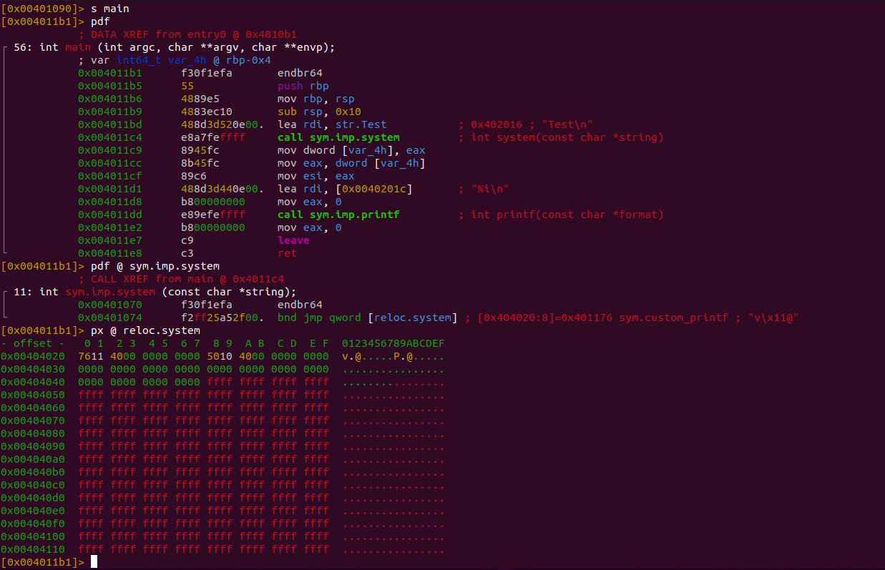

# ELFREVGO
ELFREVGO is a anti-analysis tool that helps to obfuscate ELF files. It operates on already compiled ELFs and is a great tool to create challenges for CTFs or if you just want to make a Reverse Engineer's life a bit harder. Currently, it implements 5 different techniques of obfuscation that are more or less easy to reverse (there's only so much you can change without breaking execution) that are detailed a bit further down.
## INSTALLATION
There's an already compiled version in the bin folder, if you want to compile it yourself, you can go into the src folder and run **go build ELFREVGO.go ELF_Parser.go**
## EXAMPLES
There's an example C script in the example folder as well as a shell script that compiles the script into different types of ELF files.
## OBFUSCATION TYPES
ELFREVGO will be demonstrated on the example_nopie ELF file. Here's the source code:
```C
#include <stdio.h>
#include <stdlib.h>


int custom_printf(char* input) /*This is the function we want to call instead of system*/
{
	printf("This is custom\n");
	printf("%s",input);
	return 1;
}

int main()
{
	int x = system("Test\n");  /*This is the call to system we want to replace*/
	printf("%i\n",x);
}
```
Compile this script using the following command:
```shell
gcc -no-pie example.c -o example_nopie
```
It runs fine even though it says that it can't find the command Test (this is fine, we'll fix this later). 
## CLASS OBFUSCATION
Each ELF file specifies in its header if it is a 64 bit or a 32 bit executable. ELFREVGO has the -b flag that changes this class
```shell
./ELFREVGO -f example_nopie -b -o example_output
```
If we run example_output, it still produces the same output as before. However, dissassemblers and debuggers have problems interpreting the file:
### gdb
```shell
"example_output": not in executable format: file format not recognized
(gdb) run
Starting program:  
No executable file specified.
Use the "file" or "exec-file" command.
(gdb) break main
No symbol table is loaded.  Use the "file" command.
```
### radare2
```shell
WARNING: get_sections_from_phdr: assertion 'bin && bin->phdr' failed (line 2819)
WARNING: get_sections_from_phdr: assertion 'bin && bin->phdr' failed (line 2819)
WARNING: get_sections_from_phdr: assertion 'bin && bin->phdr' failed (line 2819)
 -- Hang in there, Baby!
[0x00401090]> aa
[Cannot find function at 0x00401090 sym. and entry0 (aa)
[x] Analyze all flags starting with sym. and entry0 (aa)
[0x00401090]> afl
[0x00401090]> s main
Cannot seek to unknown address 'main'
```
### ltrace
```shell
ltrace ./example_output 
"./example_output" is ELF from incompatible architecture
```
### Reversing the obfuscation
Reversing this change isn't that hard, the reverse engineer just needs to change a single value in the ELF header.
| complexity score | time score | impact score
|--|--|--|
| ★★☆☆☆ | 10 minutes |★★★★☆

## DATA OBFUSCATION
Each ELF file specifies in its header if its values are to be interpreted as Big Endian or Little Endian. ELFREVGO has the -e flag that changes the endianness
```shell
./ELFREVGO -f example_nopie -e -o example_output
```
example_output still produces the same output as before and also can't be dissassembled with gdb or radare2.
### Reversing the obfuscation
Reversing this change again isn't that hard,  the reverse engineer just needs to change a single value in the ELF header.
| complexity score | time score | impact score
|--|--|--|
| ★★☆☆☆ | 10 minutes |★★★★☆
## SECTION TYPE OBFUSCATION
Every section in an ELF file has a certain type specified in the section header that determines their function. ELFREVGO can overwrite these section types with the flag -t
```shell
./ELFREVGO -f example_nopie -t -o example_output
```
example_output still runs fine, however it affects gdb (radare2 in this case is unaffected by the change)
### gdb
```shell
BFD: warning: example_output has a corrupt string table index - ignoring
Reading symbols from example_output...
(No debugging symbols found in example_output)
(gdb) break main
No symbol table is loaded.  Use the "file" command.
Make breakpoint pending on future shared library load? (y or [n]) n
(gdb) run
Starting program: example_output 
[Detaching after vfork from child process 2939]
sh: 1: Test: not found
32512
```
gdb cannot load the symbols due to the obfuscation so we cannot set a breakpoint on main
### ltrace
```shell
ltrace ./example_output 
Couldn't get name of section #1 from "/proc/2986/exe": invalid section
```
### readelf
```shell
There are 31 section headers, starting at offset 0x39c0:

Section Headers:
  [Nr] Name              Type             Address           Offset
       Size              EntSize          Flags  Link  Info  Align
  [ 0]                   NULL             0000000000000000  00000000
       0000000000000000  0000000000000000           0     0     0
  [ 1] .interp           NULL             0000000000400318  00000318
       000000000000001c  0000000000000000   A       0     0     1
  [ 2] .note.gnu.propert NULL             0000000000400338  00000338
       0000000000000020  0000000000000000   A       0     0     8
  [ 3] .note.gnu.build-i NULL             0000000000400358  00000358
       0000000000000024  0000000000000000   A       0     0     4
  [ 4] .note.ABI-tag     NULL             000000000040037c  0000037c
       0000000000000020  0000000000000000   A       0     0     4
  [ 5] .gnu.hash         NULL             00000000004003a0  000003a0
       000000000000001c  0000000000000000   A       6     0     8
readelf: Warning: [ 6]: Unexpected value (1) in info field.
  [ 6] .dynsym           NULL             00000000004003c0  000003c0
       0000000000000090  0000000000000018   A       7     1     8
  [ 7] .dynstr           NULL             0000000000400450  00000450
       000000000000004b  0000000000000000   A       0     0     1
  [ 8] .gnu.version      NULL             000000000040049c  0000049c
       000000000000000c  0000000000000002   A       6     0     2

```
### Reversing the obfuscation
Reversing this change requires some knowledge about section types. You could compare the section types with a normal ELF file and recuperate them but you first need to find the problem that's causing gdb and ltrace to not be able to work correctly.
| complexity score | time score | impact score
|--|--|--|
| ★★★★☆ | 30 minutes |★★★☆☆
## SECTION NAME OBFUSCATION
Every section has also a name that's specified in the section header. ELFREVGO can overwrite these names using the -n flag.
```shell
./ELFREVGO -f example_nopie -n -o example_output
```
This obfuscation doesn't affect any debugger or dissassembler but it affects readelf a bit
### readelf
```shell
Section Headers:
  [Nr] Name              Type             Address           Offset
       Size              EntSize          Flags  Link  Info  Align
  [ 0]                   NULL             0000000000000000  00000000
       0000000000000000  0000000000000000           0     0     0
  [ 1]                   PROGBITS         0000000000400318  00000318
       000000000000001c  0000000000000000   A       0     0     1
  [ 2]                   NOTE             0000000000400338  00000338
       0000000000000020  0000000000000000   A       0     0     8
  [ 3]                   NOTE             0000000000400358  00000358
       0000000000000024  0000000000000000   A       0     0     4
  [ 4]                   NOTE             000000000040037c  0000037c
       0000000000000020  0000000000000000   A       0     0     4
  [ 5]                   GNU_HASH         00000000004003a0  000003a0
       000000000000001c  0000000000000000   A       6     0     8
  [ 6]                   DYNSYM           00000000004003c0  000003c0
       0000000000000090  0000000000000018   A       7     1     8
```
```shell
Section to Segment mapping:
  Segment Sections...
   00     
   01      
   02                
   03          
   04        
   05            
   06      
   07      
   08       
   09      
   10      
   11     
   12   
   ```
### Reversing the obfuscation
Reversing this change requires parsing the section header string table and getting the offsets for each section name. This could take some time but can be done pretty much instantaneously with a script and comparing it with an obfuscated ELF file.
| complexity score | time score | impact score
|--|--|--|
| ★★★★☆ | 30 minutes |★☆☆☆☆
## GOT OBFUSCATION
The last obfuscation technique is a bit special because it requires preparations in the source code. There needs to be a replacee and a replacement
Replacee: A library function such as system that needs to be actually called in the compiled ELF (Attention: not every library function can be used. Due to optimisations by the compiler, some calls to library functions are replaced with simple assembly code. strlen is one such function that is prone to being replaced by an assembly routine). In our example script, we use system
Replacement: A user-defined function that should be called intead of the library function. In our example script, we use custom_printf

When we have those two prepared, we can use the -g flags to overwrite the GOT entries

 - -g overwrite GOT address
 - -gd name of the library function
 - -gf name of the user-defined function
 - -gx hex address of the user-defined function in case ELF is stripped
```shell
./ELFREVGO -f example_nopie -g -gd system -gf custom_printf -o example_output
```
Now we can also run example_output and get different output
```shell
./example_output 
This is custom
Test
1
```
This obfuscation greatly affects static analysis. Dissassembly shows that we are calling system but in reality we are calling custom_printf. An ELF would probably need to be run and then analyzed before any reverse engineer would see the change in the GOT.
### radare2

We can see here that the call to system still looks like a normal library call. If we look into the PLT jmp gadget, we can actually see that we jump to custom_printf but often no one looks into this section and just assumes that system would be executed.
### objdump
```shell
00000000004011b1 <main>:
  4011b1:	f3 0f 1e fa          	endbr64 
  4011b5:	55                   	push   %rbp
  4011b6:	48 89 e5             	mov    %rsp,%rbp
  4011b9:	48 83 ec 10          	sub    $0x10,%rsp
  4011bd:	48 8d 3d 52 0e 00 00 	lea    0xe52(%rip),%rdi        # 402016 <_IO_stdin_used+0x16>
  4011c4:	e8 a7 fe ff ff       	callq  401070 <system@plt>
  4011c9:	89 45 fc             	mov    %eax,-0x4(%rbp)
  4011cc:	8b 45 fc             	mov    -0x4(%rbp),%eax
  4011cf:	89 c6                	mov    %eax,%esi
  4011d1:	48 8d 3d 44 0e 00 00 	lea    0xe44(%rip),%rdi        # 40201c <_IO_stdin_used+0x1c>
  4011d8:	b8 00 00 00 00       	mov    $0x0,%eax
  4011dd:	e8 9e fe ff ff       	callq  401080 <printf@plt>
  4011e2:	b8 00 00 00 00       	mov    $0x0,%eax
  4011e7:	c9                   	leaveq 
  4011e8:	c3                   	retq   
  4011e9:	0f 1f 80 00 00 00 00 	nopl   0x0(%rax)
```
objdump also doesn't notice the overwritten GOT entry.
### Reversing the obfuscation
In order to reverse this obfuscation, you could probably patch the call to system and replace it with a call to custom_printf. Other than that, this doesn't require a major effort to reverse.
| complexity score | time score | impact score
|--|--|--|
| ★★★☆☆ | 20 minutes |★★★☆☆
## Modularity of ELFREVGO
The great thing about ELFREVGO is its modularity. You can combine obfuscations to make reversing the binaries harder. You can even replace multiple library functions with different user-defined functions and to best of all is that nothing breaks the binary and it still runs normally. For a moderately hard CTF challenge, combine every single obfuscation technique together and make complex user-defined functions that closely mirror the library functions they replace.
## Extension
If you have any ideas on how to extend this project, feel free to open an issue or simply clone this repository and open a pull request.
## Sources
I wrote this code from scratch, however the ideas for the different obfuscation techniques came from different people. The class obfuscation was used in castorsCTF 2020 in a challenge made by students from Polytechnic University of Puerto Rico. Their CTF was actually really great so check them out if they do one again in the future. The idea for the overwrite section types obfuscation came from Keith Makan who wrote a great primer on the ELF architecture. I was relying primarily on him and Wikipedia for information regarding the ELF structure (it's quite scarce) and you can find the article on his blog at https://blog.k3170makan.com/2018/10/introduction-to-elf-format-part-iv.html .
The idea for the GOT obfuscation came from a challenge in X-MAS CTF 2020 where it was actually implemented at runtime instead of before, which makes my implementation even a bit harder to detect. The CTF was made by Hecării, Țuica și Păunii and it was also extremely interesting, definitely check their next one out. You can find their website at https://htsp.ro/ .
#### PS
Crowdstrike pls hire me
